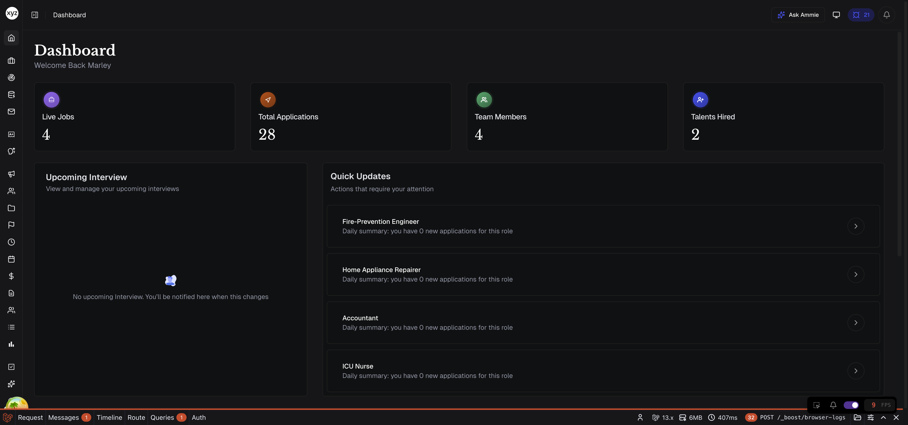
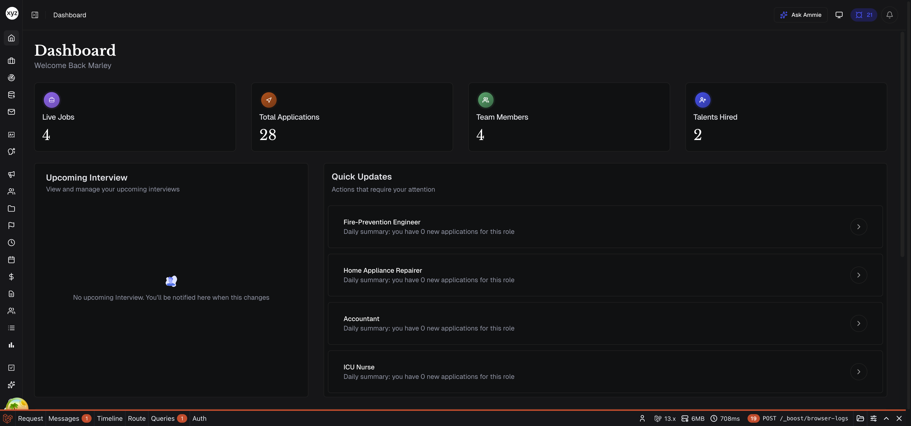

# A quick tour of the app

> A two-minute lay of the land so you know where everything lives.

## The main areas

1. **Sidebar (left)** — the front door to every workspace area: Jobs, Talent, Inbox, Calendar, Interviews, Insights, and more. The active area is highlighted.
   
2. **Top bar** — global search, your inbox, notifications, and your profile menu live here. Press `/` from anywhere to focus search.
   
3. **Main canvas** — whatever you opened from the sidebar fills this area. Most pages have filters at the top and bulk actions on selected rows.
   
4. **Settings** — workspace-wide settings (company, team, departments, integrations, billing) live under your profile menu → **Settings**. Personal settings (security, notifications, working hours) are under **Account**.
   

## Quick tips

- **Keyboard shortcuts** — press `?` on any page to see what's available there.
- **Global search** — works across jobs, candidates, conversations, and documents.
- **Help** — the question-mark icon in the top bar opens this help center and a way to message support.

## Where to go next

- Set up your [company profile](../getting-started-set-up-company-profile/ARTICLE.md).
- [Invite your team](../getting-started-invite-team-members/ARTICLE.md).
- Lock down your account with [2FA and passkeys](../getting-started-2fa-and-passkeys/ARTICLE.md).

## Related articles
- [Create your business account](../getting-started-create-account/ARTICLE.md)
- [Set up your company profile](../getting-started-set-up-company-profile/ARTICLE.md)
- [Invite team members](../getting-started-invite-team-members/ARTICLE.md)
